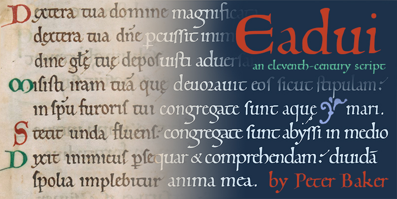

# Eadui-Font

Eadui is a script font based on the hand of the eleventh-century scribe Eadui Basan

Version 1 of this Open Source font (SIL Open Font License) was released via the Open Font Library
(www.openfontlibrary.org). Version 2 featured improved outlines and completely
reworked OpenType tables. Version 3, the current version, is a color font which retains the
features of version 2 and adds many OpenType features for color management. The colors of
version 3 are based on manuscripts written by Eadui.

For mounting on a web server, download `Eadui-CPAL.otf`, which uses a compact format recognized by
all modern browsers. For installing on a desktop, download `Eadui-SVG`, which combines two formats
for maximum flexibility.
